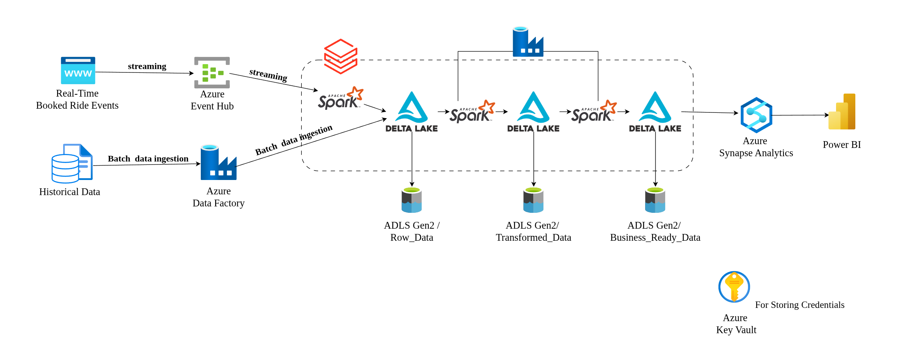
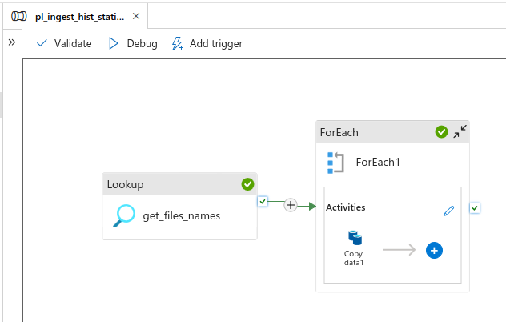
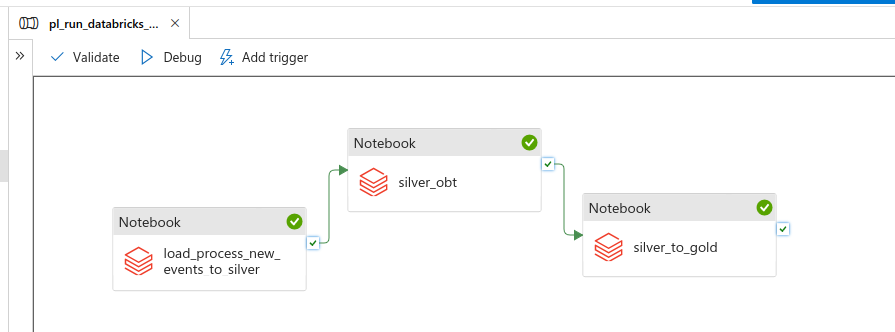
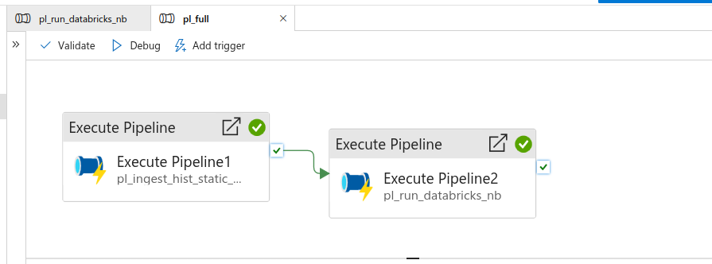
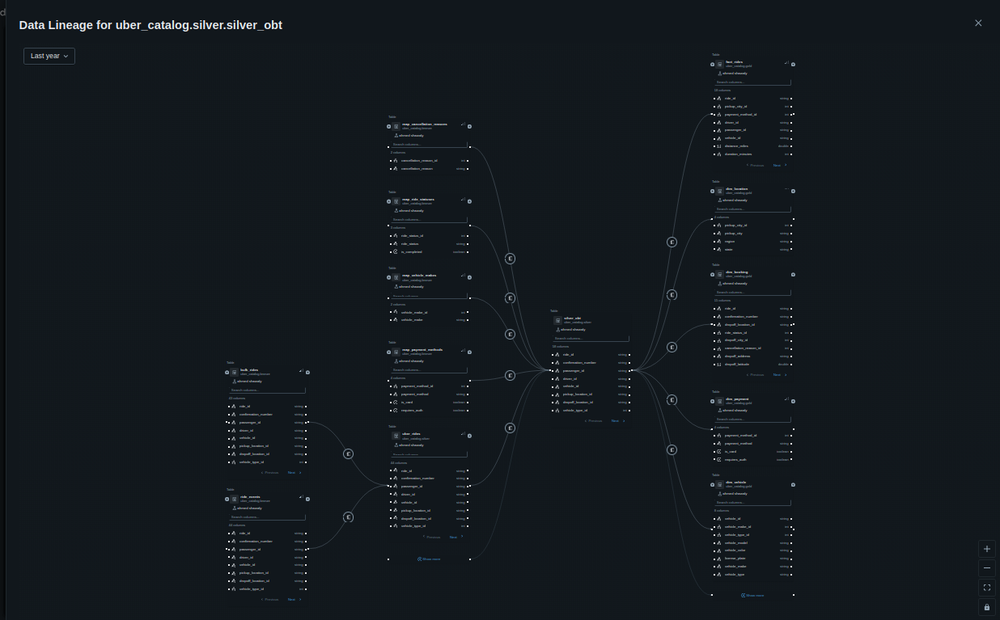
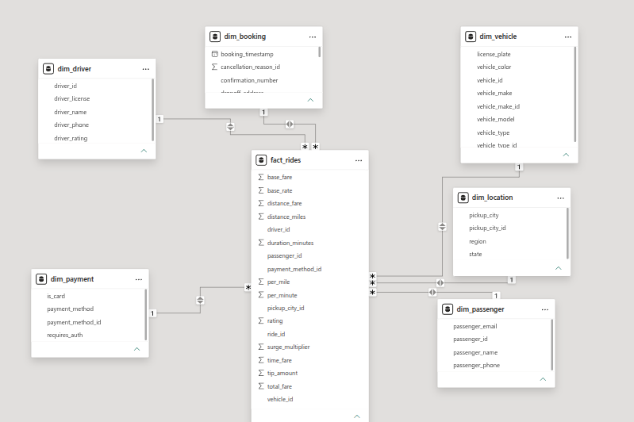

#  Azure End-to-End Data Platform

An end-to-end data engineering platform built on **Microsoft Azure** that processes both **real-time streaming** and **batch historical** data. The platform transforms raw data and streaming events through a **Medallion Architecture (Bronze → Silver → Gold)** and delivers business-ready insights for analytics and reporting.

---

##  Architecture Overview



The platform ingests data from two sources:
- **Real-time ride booking events** via Azure Event Hub + Apache Spark Structured Streaming
- **Historical / static data** via Azure Data Factory batch ingestion

Data flows through three Delta Lake layers stored in ADLS Gen2, gets modeled into a Star Schema in Azure Synapse Analytics, and is visualized in Power BI.

---

##  Tech Stack

| Layer | Technology |
|---|---|
| Streaming Ingestion | Azure Event Hub |
| Batch Ingestion | Azure Data Factory |
| Processing & Transformation | Apache Spark (PySpark) on Azure Databricks |
| Storage | Azure Data Lake Storage Gen2 (ADLS Gen2) |
| Table Format | Delta Lake |
| Data Governance | Unity Catalog (Azure Databricks) |
| Analytics Warehouse | Azure Synapse Analytics |
| Reporting | Power BI |
| Secret Management | Azure Key Vault |
| Orchestration | Azure Data Factory Pipelines |

---

##  Repository Structure

```
Azure-End-to-End-Data-Platform/
│
├── fast_api/
│   ├── templates/
│   ├── api.py
│   ├── data.py
│   └── producer.py           # Real-time ride event producer
│
├── notebooks_code/
│   ├── 1_configure_EXT_locations_schemas.sql
│   ├── 2_register_bronze_tables.sql
│   ├── 3_events_consumer.py          # Spark Structured Streaming consumer
│   ├── 4_silver_and_watermark_setup.sql
│   ├── 5_process_load_new_events_to_silver.sql
│   ├── 6_silver_OBT.sql              # One Big Table transformation
│   └── 7_create_star_schema_model.sql
│
├── uber-proj-adf/             # Azure Data Factory pipeline definitions
├── .gitignore
└── README.md
```


---

## ⚡ Real-Time Streaming Pipeline

1. A **FastAPI producer application** (`producer.py`) generates live ride-booking events
2. Events are streamed to **Azure Event Hub**
3. **Apache Spark Structured Streaming** on Azure Databricks consumes the events
4. Processed records are written to **Delta Lake Bronze tables** in ADLS Gen2
5. Incremental data is loaded and processed up to the **Silver layer** using watermark-based deduplication

---

##  Batch Ingestion Pipeline

A **metadata-driven pipeline** in Azure Data Factory handles all historical and static data ingestion.



- **Lookup activity** (`get_files_names`) dynamically retrieves the list of files to process
- **ForEach activity** iterates over each file and triggers a **Copy Data** activity
- Data lands in **ADLS Gen2 / Raw_Data** (Bronze layer)

---

##  Transformation & Orchestration

### Databricks Notebook Pipeline

Transformations are executed as a sequence of Databricks notebooks, orchestrated by Azure Data Factory:



| Step | Notebook | Description |
|---|---|---|
| 1 | `load_process_new_events_to_silver` | Loads and processes new streaming events into the Silver layer |
| 2 | `silver_obt` | Creates a Silver One Big Table (OBT) by joining and enriching data |
| 3 | `silver_to_gold` | Transforms Silver OBT into the Gold Star Schema model |

### Master Orchestration Pipeline

A top-level `pl_full` pipeline chains all sub-pipelines together:



- **Execute Pipeline 1** → `pl_ingest_hist_static_` (Batch ingestion)
- **Execute Pipeline 2** → `pl_run_databricks_nb` (Databricks transformations)

---

##  Data Governance — Unity Catalog

Unity Catalog provides a unified governance layer across all data layers (`bronze`, `silver`, `gold`) within the `uber_catalog`.

### Data Lineage

Full column-level lineage is tracked automatically:




---

## 🌟 Star Schema Model (Gold Layer)

A dimensional Star Schema model is delivered into **Azure Synapse Analytics** for efficient analytical querying.




---

## 🌟 About Me

Hi there! I’m **Ahmed Shawaly**, a Data & Analytics Engineer passionate about building modern, scalable data systems.


I enjoy building reliable data architectures, optimizing data pipelines, and transforming raw data into meaningful, business-ready insights.

Let’s connect and share ideas!

 [LinkedIn](https://www.linkedin.com/in/ahmed-shawaly/)  
 ahmed.shawaly74@gmail.com